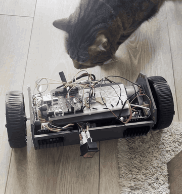
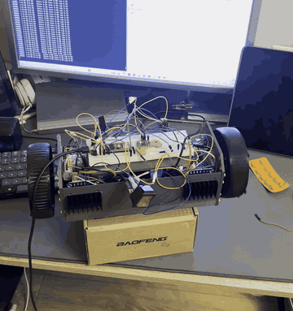

# Self-Balancing Robot

A two-wheel inverted pendulum on a **Teensy 4.1**, flown from a **TX16S over
ELRS/CRSF**. It stands itself up, holds its spot, drives and pivots under stick
control, and latches safe when it reaches its frame.

The control structure is a **cascade**: the pilot drives a *velocity setpoint*,
never the lean and never the motors. Stick → wheel velocity → integrated into a
position setpoint → an always-closed outer loop derives the **lean** → a fast
inner pitch PD chases that lean. This is the librobotcontrol / `rc_balance`
(EduMiP) structure.

> **The single most important idea in this repo:** *lean is an output, not a
> command.* A lean angle is an **acceleration** command — holding lean θ requires
> sustained wheel acceleration of `g·tan(θ)`, so constant speed needs **zero**
> lean. Every drive feature that failed here failed by bypassing the cascade and
> commanding lean or PWM directly.

## Demo

**Balancing on the floor, under inspection** — the chassis holds itself upright
on 140 mm wheels while the outer loop keeps it near its home position, and takes
a poke from the resident QA department without going over.



**Bench test with live telemetry** — propped on a box with the wheels free, the
TX16S driving it and the 100 ms telemetry stream scrolling on the monitor. Most
of the tuning in this repo was read off that stream.



The GIFs are 8 fps and downscaled. Full-quality 30 fps versions of the same ten
seconds are committed alongside them and play in GitHub's file view:
[balancing-floor.mp4](docs/media/balancing-floor.mp4) ·
[bench-telemetry.mp4](docs/media/bench-telemetry.mp4)

## Project Structure

```
self-balancing-robot/
├── balance_v2/
│   ├── balance_v2.ino      # the entire controller (single file)
│   └── crsf.h              # ELRS/CRSF parser + TX16S channel map
├── flash.sh                # build/flash pipeline (OneDrive -> WSL -> board)
├── docs/media/             # demo clips (GIF for inline, MP4 for full quality)
├── CONTROL_THEORY.md       # derivation and physics
├── MIGRATION_TEENSY.md     # V1 Uno -> V2 Teensy 4.1 port plan
├── PATCHES_FROM_CASCADE.md # salvage list from an abandoned branch
├── SHARP_2Y0A21_SPEC.md    # collision avoidance: wiring + config spec (not built)
└── README.md
```

## Hardware

| | |
|---|---|
| **MCU** | Teensy 4.1 (600 MHz) — *not 5 V tolerant* |
| **IMU** | GY-91 / MPU9250 (accel + gyro; mag/baro unused) |
| **Motor driver** | 2x IBT-2 / BTS7960 H-bridge, one per motor |
| **Motors** | 2x Waveshare DCGM-3865, 12 V, 42:1, integrated Hall encoders |
| **Encoder resolution** | **546 counts/rev** at the output shaft (13 PPR x 42:1, rising edges of A) |
| **Wheels** | **140 mm** (were 120 mm, originally 90–100 mm) |
| **Radio** | RadioMaster RP1 ELRS RX -> `Serial1` @ 420000 8N1, TX16S |
| **Power** | 4S LiPo (~14–16.8 V) -> motors; buck -> 5 V / 3.3 V logic |

> ⚠️ Motors are rated **12 V** and the 4S pack runs up to **16.8 V**. `MAX_PWM`
> is the current limiter — watch motor temperature.

### Pinout (Teensy 4.1)

| Function | Pin | Notes |
|---|---|---|
| Left motor FWD / REV | 6 / 9 | FlexPWM2.2 A/B |
| Right motor FWD / REV | 22 / 23 | FlexPWM4.0 / 4.1 |
| Left encoder A / B | 2 / 3 | A on interrupt |
| Right encoder A / B | 4 / 5 | A on interrupt |
| IMU SDA / SCL | 18 / 19 | `Wire` default |
| CRSF RX | `Serial1` (0 / 1) | 420000 baud |

**Power the encoders from 3.3 V**, not 5 V — the Teensy's inputs are not 5 V
tolerant. The 6-pin PH2.0 motor cable is silkscreened `M V A B G M`:

| Pin | Label | Wire | Function |
|---|---|---|---|
| 1 | M | white | motor power (M−) |
| 2 | V | blue | encoder supply -> **3.3 V** |
| 3 | A | green | Hall A -> interrupt pin |
| 4 | B | yellow | Hall B |
| 5 | G | black | encoder ground (shared) |
| 6 | M | white | motor power (M+) |

Both `M` wires are white and interchangeable — if a wheel runs backwards, swap
them. All logic grounds must share a reference with the driver ground.

> **PWM frequency is a control parameter, not a cosmetic one.** The BTS7960 has
> a ~8 µs input-to-output turn-on delay, so any pulse shorter than that produces
> *nothing*. At 20 kHz that swallows ~41 PWM counts and looks exactly like a
> stiction wall; at `MOTOR_PWM_HZ 2000` it costs ~2. **Never change
> `MOTOR_PWM_HZ` without re-running `DEADBAND_TEST`** — the deadband numbers
> below were measured at 2000 Hz and are only valid there.

## Radio Control (TX16S)

| Channel | Control | Function |
|---|---|---|
| CH1 | right stick, horizontal | **turn** — open-loop effort differential |
| CH2 | right stick, vertical | **drive** — commands wheel velocity |
| CH3 | left stick, vertical | **speed cap** — scales everything |
| CH6 | SB | **arm / kill** — disarmed cuts the motors and clears all state |
| CH7 | SC | gain select (Kp / Kd / Kvel) |
| CH8 | S1 knob | live tune for the selected gain ("pickup" style — the knob only takes over once moved) |

Link loss for `LINK_TIMEOUT_MS` (500 ms) disarms.

## Control Algorithm

**Estimator** — complementary filter, 99 % gyro integration + 1 % accelerometer.

> **IMU axis gotcha:** the pitch-axis rate is `-(getGyroY() - bias)`, **not** X.
> A library update silently moved it once, which zeroed the rate signal and made
> the robot "balance slowly but explode when pushed". Re-verify with `IMU_TEST`
> after any IMU or library change.

**Outer loop** — runs always, and produces a lean:

```c
posSetpoint += targetVel * DT;                       // the stick's ONLY path in
posSetpoint  = constrain(posSetpoint, positionRev +/- POS_ERROR_CLAMP);

posError = posSetpoint - positionRev;                // rev
velError = targetVel   - forwardVel;                 // rev/s

velocityLeanI += KVEL_I * velError * DT;             // clamped to +/-VEL_I_CLAMP
leanRaw  = Kpos*posError + Kvel*velError + velocityLeanI;
leanCmd  = LEAN_LPF*leanCmd + (1-LEAN_LPF)*leanRaw;
```

**Inner loop** — pitch PD onto the leaned target:

```c
TARGET = BALANCE_SETPOINT + leanCmd;
error  = pitch - TARGET;
u      = -(Kp*error + Kd*rateFilt + Ki*integral);    // D on a low-passed rate
```

**Output stage** — two corrections, deliberately separate:

```c
pwm  = plainFloor * min(|u|/FLOOR_KNEE, 1) + |u|     // Coulomb friction floor
pwm += EMF_FF_SIGN * EMF_FF_GAIN * forwardVel        // back-EMF, COMMON MODE
```

The friction floor is a **continuous blend** from the static to the moving
deadband, driven by speed. It used to be a binary `moving ? dbMoving : dbStatic`
gate, which square-waved the output by 8 counts at loop rate and produced an
~8.7 Hz limit cycle.

The back-EMF term is **common mode on purpose** — driven by `forwardVel`, the
mean. Per-wheel (each wheel from its own velocity) it is a differential
positive-feedback loop of gain `EMF_FF_GAIN / K_EMF` = 35/43.6 = **0.80**, which
settles any wheel-speed difference at **5x** its true size and makes the robot
curve with the stick centred. Note this also means the term contributes
**exactly zero in a pure pivot**, since `forwardVel` is zero when the wheels
counter-rotate — pivot authority comes from `TURN_AUTHORITY` alone.

### Non-obvious pieces

- **`LEAN_LPF` must be slower than the plant's wrong-way transient.** To lean
  forward the wheels must first roll *backward* (non-minimum phase). An outer
  loop faster than that transient (~100–300 ms) re-commands the lean mid-swing,
  which is positive feedback, and the robot runs away.
- **Turn must beat the balance effort, not merely reduce it.** `effortL = u +
  turn`, `effortR = u - turn`, floored independently. Counter-rotation needs the
  two to have **opposite signs**, i.e. `|turn| > |u|`. Below that both wheels are
  driven the same way and the weaker one drops under its breakaway and simply
  sits — looking exactly like a dead wheel.
- **Coast band.** With `|error| < ANGLE_DEADZONE` and the wheels stopped, output
  is forced to 0. Motor buzz causes chassis vibration, the gyro reads that as
  motion, which causes more buzz; cutting the motors breaks the loop.
- **Beware bare thresholds.** `VF` is quantised at **0.366 rev/s per encoder
  count** before filtering, so *any* bare threshold on it in the 0–0.5 band
  chatters at loop rate. This has caused three separate destructive bugs here —
  the floor gate, the integral rolling detector, and the `driving` flag. All
  three are now hysteretic or debounced. **Treat a new bare threshold on a noisy
  signal as a bug on sight.**

See **[CONTROL_THEORY.md](CONTROL_THEORY.md)** for the derivation.

## Current Tune

| Param | Value | Meaning |
|---|---|---|
| `Kp` / `Kd` / `Ki` | 2.0 / 0.3 / 0.0 | inner pitch PD (Ki unused) |
| `DRIVE_KP` / `DRIVE_KD` | 4.0 / 0.20 | gain schedule while driving |
| `Kpos` | 6.0 | position error -> lean (deg per rev) |
| `Kvel` | 3.0 | velocity error -> lean (deg per rev/s) |
| `KVEL_I` | 24.0 | velocity-error integral rate |
| `VEL_I_CLAMP` | 20.0° | **dominant term; sets the reachable lean** |
| `POS_ERROR_CLAMP` | 1.5 rev | position backstop, caps the `Kpos` term at 9° |
| `LEAN_LPF` | 0.95 | ~98 ms EMA on `leanCmd` |
| `BALANCE_SETPOINT` | −3.22° | calibrate per build, on the wheels |
| `MAX_PWM` | 140 | output ceiling |
| deadbands | 10 / 10 moving, **18 / 18 static** | measured at 2000 Hz, symmetric |
| `FLOOR_KNEE` | 5.0 | floor ramp; **a trade-off, not a fix** (see below) |
| `EMF_FF_GAIN` | 35 | PWM per rev/s — 80 % of the measured 43.6 |
| `DRIVE_MIN_VEL` / `DRIVE_MAX_VEL` | 0.30 / 0.90 rev/s | the stick maps to this span |
| `TURN_AUTHORITY` | 32 | effort differential at full turn stick |
| `TURN_THROTTLE_FLOOR` | 0.75 | fraction of turn available at zero throttle |
| `FALL_CUTOFF` fwd / rear | 63° / 47° | at the measured frame contacts |
| control loop | 200 Hz | fixed `dt` |

**Measured chassis limits (140 mm wheels):** the frame stops at **+61° / −51°**
pitch. Geometry is no longer the binding constraint on lean.

**`FLOOR_KNEE` is a trade-off.** It sets the zero-crossing incremental gain
(`floor/KNEE + 1`): 5.0 gives 4.6, 2.5 gives 8.2 (jitters), 1.0 gives 19.0
(unusable). Lowering it buys breakaway and costs a limit cycle. Do not reach for
it to fix breakaway — it trades one symptom for the other.

## Building & Flashing

`flash.sh` syncs the Windows/OneDrive copy into WSL and builds *that*, then
uploads. Teensy uploads run through the **Windows** loader, because the board
re-enumerates to a different USB device in bootloader mode and that breaks
`usbipd` mid-flash.

```bash
bash flash.sh --sketch balance_v2 --teensy --all
```

One-time core install:

```bash
bash flash.sh --board teensy --setup
```

Other forms: `--compile` (build only), `--clean` (from scratch), `--monitor
--port COM5` (serial).

> Read telemetry with `screen` at **115200**. `arduino-cli monitor --config
> baudrate=` is unreliable here and produces garbled output.

## Test Harnesses

Set the `#define` to `1`, flash, read the serial output, then set it back to `0`.
All are off in flight builds.

| Mode | What it measures |
|---|---|
| `ENCODER_TEST` | motors off; roll by hand, one turn should be ~546 counts |
| `DEADBAND_TEST` | multi-pass PWM ramp -> per-wheel static/moving breakaway, with spreads |
| `EMF_TEST` | steps PWM, fits `PWM = K_EMF * rev/s + intercept` per wheel |
| `LEAN_SWEEP` | motors off; finds rest angles and frame stops under a slow push |
| `STATIC_LEAN_TEST` | holds a fixed commanded lean |
| `IMU_TEST` | which gyro axis tracks pitch |
| `BURST_LOG` | 400-sample (2 s) full-rate capture, dumped after the event |

> **Measure distributions, not single samples.** Single ramps produced several
> findings here that later evaporated — a per-wheel deadband difference that
> vanished once each wheel's own spread was measured, and a tether-load trend
> fitted to three medians and killed by a fourth. `DEADBAND_TEST` runs six
> passes for exactly this reason.
>
> Equally: **a rest angle reached by *releasing* the chassis is not a limit.** A
> limit is where the chassis stops under a slow deliberate push *and* reproduces
> across sweeps. That confusion cost two sessions.

## Telemetry

One line per 100 ms, in labelled groups:

```
MS 21070 STATE DRIVE LINK Y ARM Y HZ 200
| IMU   AP 21.41 PITCH 20.58 TARGET 20.85 ERR -0.27 RATE 0.42 DFILT 0.62 ...
| PID   P -1.09 I 0.00 D -0.63 U 1.72 EL 1.72 ER 1.72 PWML 7 PWMR 7
| ENC   L -23 R -22 VL -0.01 VR -0.00 VF -0.00 VROT -0.00 POS 0.041
| TRK   TVEL 0.65 PSET 1.372 PERR 1.413 VERR 0.65 SOFT 1.00
| LEAN  ACT 23.80 POS 8.48 VEL 1.95 VELI 14.00 RAW 24.43 CMD 24.07
| RC    SPD 1.00 CAP 1.00 DRAW 0.99 TRAW 0.00 DCMD 0.99 TCMD 0.00 TEFF 0.00
| CFG   Kp 2.00 Kpeff 3.98 Kd 0.30 ... DBF 17.7 PWMHZ 2000
```

| Field | Meaning |
|---|---|
| `PITCH` / `TARGET` / `ERR` | estimate, `BALANCE_SETPOINT + leanCmd`, and the tracking error |
| `U` / `EL` / `ER` | inner-loop effort, then per-wheel after the turn mix |
| `VF` / `VROT` | chassis forward and rotational speed (rev/s) |
| `POS` / `PSET` / `PERR` | measured position, setpoint, and error (rev) |
| `TVEL` / `VERR` | commanded velocity and its error |
| `LEAN POS/VEL/VELI` | the three outer-loop terms — **read these to see which one saturated** |
| `LEAN ACT` vs `CMD` | achieved lean vs commanded |
| `EMF` | back-EMF feedforward, per wheel — **must print identical values** |
| `DBF` | the live blended friction floor |

**Reading it:** `ERR ~ 0` *and* `U ~ 0` *and* `PWM 0` at a large sustained lean
means the target is sitting on a **torque null**, not that the loop is losing —
a loop that is losing shows large `ERR` and saturated `u`. And `LEAN RAW == CMD`
is a question, not a finding: a pinned clamp, a dragging wheel, and an
over-large velocity demand all produce the same signature.

## Known Limits & Open Work

- **Dead time before breakaway.** At standstill the loop tracks the commanded
  lean perfectly while producing less torque than static friction, so nothing
  moves for ~2 s while the lean ramps. `PWM` alternates sign below the floor
  during this — that is the buzz you hear before it goes.
- **The lean ceiling is a sum of clamps**, not a single constant:
  `Kpos * POS_ERROR_CLAMP (9°) + Kvel * velError (~2°) + VEL_I_CLAMP (20°)`, so
  about 31°. Breakaway was measured at ~26°, so the margin is real but not large.
- **Low CoM is the root cause.** Acceleration goes as
  `g * L * sin(θ) / (R + L * cos(θ))` — with `L` (CoM height above the axle)
  small, a large lean buys little force and the loop has to wind further for the
  same acceleration. **Raising the CoM is the real fix**; `VEL_I_CLAMP` is a
  workaround. Bigger wheels also *cut* ground force as `τ/R` (120 to 140 mm is
  1.167x), so they traded torque for reach.
- **Lean collapses on reaching commanded speed.** Expected — at the target
  velocity there is no acceleration left to demand, so the lean must go. Not
  tunable away; only postponable by raising `DRIVE_MAX_VEL`.
- **A rear torque null sits at PITCH −18.2°.** A target placed on it has zero
  drive authority. The forward null vanished with the 140 mm wheels.

## Troubleshooting

**Leans correctly but will not move** — check for the torque-null signature
(`ERR ~ 0`, `U ~ 0`, `PWM 0`) before touching anything. Otherwise it is the
friction floor against available gravity torque; look at `LEAN VELI` and whether
it reached `VEL_I_CLAMP`.

**One wheel spins, the other sits** — the turn is losing the sign contest to
`u`. Compare `TEFF` against `U`; raise `TURN_AUTHORITY` or
`TURN_THROTTLE_FLOOR`.

**Robot curves with the stick centred** — `EMF L/R` should print **identical**
values. A split means the back-EMF term has gone per-wheel again.

**Loses its lean mid-drive** — check whether `VELI` *steps* to zero (a state
wipe: something toggled `driving`, or a reset path fired) or *slides* down (the
loop arriving at commanded speed, which is correct behaviour).

**Balances but explodes when pushed** — verify the gyro axis with `IMU_TEST`. A
dead rate signal balances on the accelerometer alone and has no damping.

**Motors buzz at rest** — widen `ANGLE_DEADZONE` until `U` reaches 0 when
settled. Residual vibration is mechanical; an isolating IMU mount removes it at
source and lets you carry more `Kd`.

## Working Practice

Two rules, both learned expensively:

1. **Revert before theorising.** When a symptom appears right after a change,
   revert and re-fly *before* reading the new telemetry as evidence. A change
   that moves the operating point makes the log say things that are true of the
   log and false of the robot.
2. **Diff the working tag first.** `git diff v2-lean-baseline HEAD --
   balance_v2/balance_v2.ino` is a 30-second check that beats any amount of
   telemetry reading. It once surfaced twelve accumulated changes, including a
   constant that was believed reverted and was not.

Tags: `v1.0-arduino`, `v2-drive-works`, **`v2-lean-baseline`** (current
reference build).

## License

MIT
